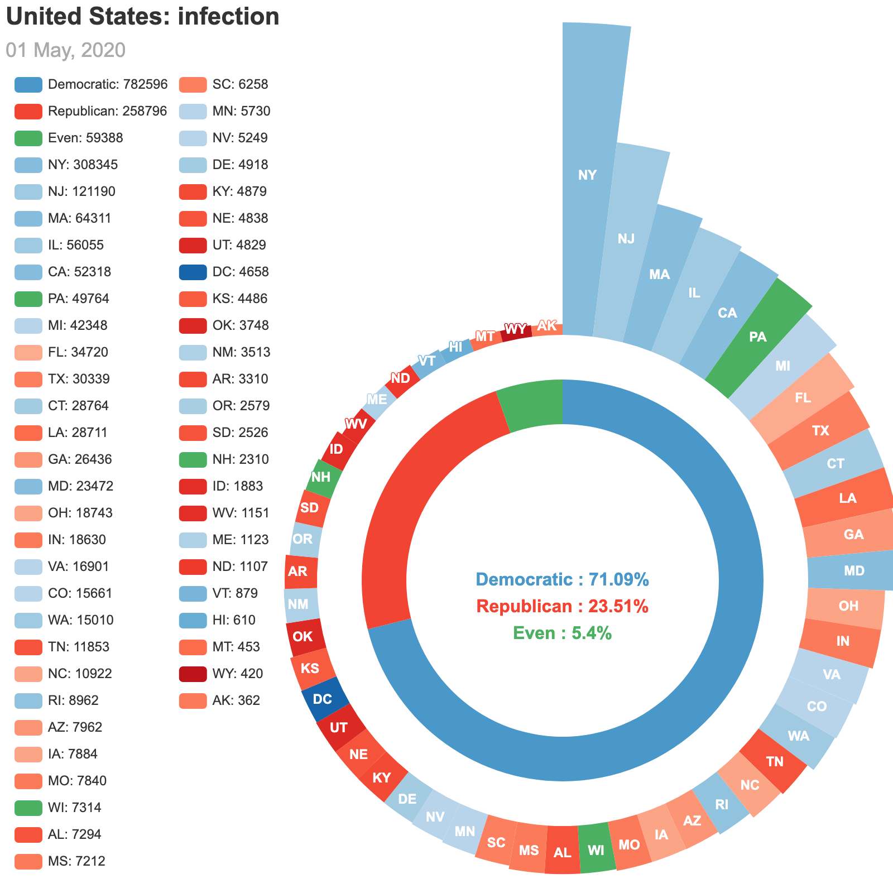
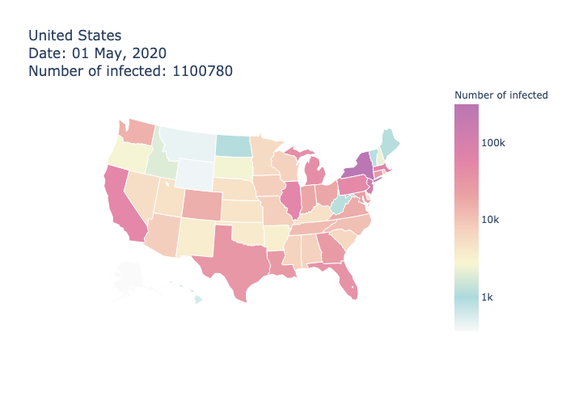

# US-COVID-19-Impact-Assesements

<table align = "center">
  <tr>
    <th></th>
    <th></th>
  </tr>
</table>

## About

> Use SEIR compartment meta-population model to evaluate the effectiveness of travel restrictions on mitigating COVID-19 pandemic.

## Scripts

### [COVID-19 information](./scripts/utils_disease_US.ipynb)

## Projects

### Future

#### - When will the second wave come?

### Current

#### - [When and how will the COVID-19 pandemic end in the United States?](https://fudab.github.io/covid-19/us)

### Complete

#### [Bag End](https://fudab.github.io/covid-19/bag_end_us)

> * A summary on the county level.
> * Where it spreads faster, urban areas or rural areas? 
> * The current situation in New England.
>   * `Dartmouth College` $\in$ `Hanover` $\in$ `Grafton` $\in$ `New Hampshire` $\in$ `New England`
> * Correlations with stock market and mobility.
>   * S & P 500 index
>   * Fortune 500 companies: `e-commerce`, `pharmaceutical giants`, ...

